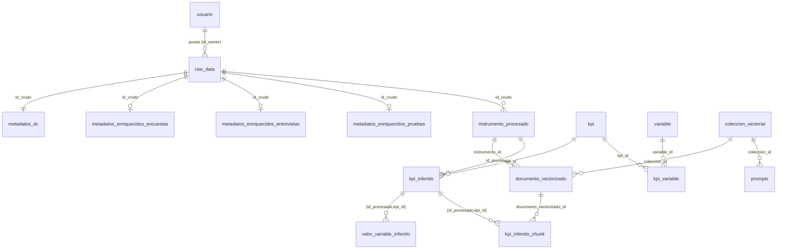

# DOCUMENTACIÓN COMPLETA — Indagata

> Guía única del proyecto **Indagata**: una plataforma de microservicios para
> cargar instrumentos de investigación educativa (encuestas, entrevistas,
> pruebas), enriquecerlos con metadatos, asociarles **KPIs** por similitud
> semántica y conversar con ellos mediante **RAG** (recuperación aumentada por
> generación).


Todo lo que aquí se describe refleja el código real del repositorio en la rama
`pruebas`. Cuando algo todavía no está terminado, se dice explícitamente.

---

## Índice

1. [Cómo levantar el proyecto desde cero](#seccion-1--como-levantar-el-proyecto-desde-cero)
   - 1b. [Usuarios e instrumentos paso a paso](#seccion-1b--usuarios-e-instrumentos-paso-a-paso)
2. [Base de datos actual](#seccion-2--base-de-datos-actual)
3. [Microservicios](#seccion-3--microservicios)
4. [Base de datos vectorial (ChromaDB)](#seccion-4--base-de-datos-vectorial-chromadb)
5. [RAG completo](#seccion-5--rag-completo)

---

## Glosario rápido (términos que se usan en toda la guía)

- **Contenedor**: una "mini-computadora" aislada que corre un programa (por
  ejemplo la base de datos o un microservicio). Docker los crea y los apaga por
  ti; no necesitas instalar cada programa a mano.
- **Imagen**: la "plantilla" desde la que se crea un contenedor.
- **Volumen**: un espacio de disco que Docker reserva para que los datos de un
  contenedor **sobrevivan** aunque el contenedor se apague o se vuelva a crear
  (por ejemplo, los datos de la base de datos).
- **Microservicio**: un programa pequeño que hace una sola cosa (cargar
  archivos, guardar metadatos, etc.). Indagata está hecho de varios
  microservicios que se comunican entre sí.
- **API Gateway**: la puerta de entrada única. El frontend habla con el gateway
  y éste reenvía cada petición al microservicio correcto.
- **Embedding**: una representación numérica (un vector de números) de un texto.
  Dos textos con significado parecido tienen vectores "cercanos". Es lo que
  permite buscar por *significado* y no solo por palabras exactas.
- **RAG** (Retrieval-Augmented Generation): primero se **recuperan** fragmentos
  relevantes de tus documentos (retrieval) y luego un modelo de lenguaje
  **genera** una respuesta apoyándose solo en esos fragmentos (generation).
- **JWT**: el "pase" firmado que el sistema te entrega al iniciar sesión y que
  viaja en cada petición para demostrar quién eres.

---

<a id="seccion-1--como-levantar-el-proyecto-desde-cero"></a>

# SECCIÓN 1 — Cómo levantar el proyecto desde cero

> Punto de partida: ya tienes el repositorio **clonado** en tu equipo (la carpeta
> `indagata`). Si no, pídele a quien te lo compartió la URL y clónalo primero.
> Todos los comandos están pensados para **Windows con PowerShell**.

## 1.1 Qué vas a levantar

El proyecto tiene dos partes:

1. **El backend y la infraestructura**, que corre dentro de **contenedores
   Docker** (base de datos, modelo de IA, base vectorial, y los 6
   microservicios).
2. **El frontend** (la interfaz web `pixel-perfect-pixel`), que se corre **fuera
   de Docker** con la herramienta **Bun**.

> ⚠️ **Importante:** en `docker-compose.yml` existe un servicio llamado
> `frontend` que **NO es la aplicación real**. La interfaz real es
> `pixel-perfect-pixel` y se ejecuta aparte (ver paso 1.8). Ignora el contenedor
> `frontend`.

## 1.2 Requisitos previos (instalar una sola vez)

| Herramienta | Para qué | Dónde se obtiene |
|---|---|---|
| **Docker Desktop** | Corre toda la infraestructura y los microservicios | https://www.docker.com/products/docker-desktop/ |
| **Bun** | Instala dependencias y corre el frontend | https://bun.sh (en Windows: `powershell -c "irm bun.sh/install.ps1 | iex"`) |
| **Git** | Para clonar/actualizar el repo | https://git-scm.com |

> 💡 El frontend declara sus dependencias en `pixel-perfect-pixel/package.json` y
> trae un `bun.lock`, por eso se usa **Bun** (no `npm`). El backend no necesita
> que instales Python ni PostgreSQL: todo vive en contenedores.

Verifica que Docker esté instalado y corriendo:

```powershell
docker --version
docker compose version
```

Si Docker Desktop no está abierto, ábrelo y espera a que diga "Engine running".

> 🖥️ **GPU (opcional pero recomendado para el chat):** el servicio del modelo
> (`ollama`) está configurado para usar GPU NVIDIA. Si tienes una (por ejemplo
> una GTX 1650 de 4 GB) y los drivers + NVIDIA Container Toolkit instalados, el
> modelo responderá en segundos. Sin GPU, Docker igual levanta Ollama pero el
> modelo correrá en CPU (más lento). El resto del sistema **no** necesita GPU.

## 1.3 Configurar las variables de entorno

Hay dos archivos `.env` que debes crear a partir de sus ejemplos.

**(a) El `.env` de la raíz** (lo consume Docker Compose y todos los servicios):

```powershell
# Desde la raíz del repositorio (la carpeta indagata)
Copy-Item .env.example .env
```

El `.env.example` ya trae valores por defecto que funcionan para desarrollo. Las
variables más importantes son:

| Variable | Valor por defecto | Qué controla |
|---|---|---|
| `POSTGRES_DB` / `POSTGRES_USER` / `POSTGRES_PASSWORD` | `indagata_db` / `postgres` / `securepassword` | Credenciales de la base de datos |
| `SECRET_KEY` | `your-super-secret-key-change-in-production` | **Clave para firmar el JWT. Debe ser la MISMA en todos los servicios.** |
| `OLLAMA_MODEL` | `llama3.2:3b` | Modelo de lenguaje para el chat |
| `EMBEDDING_MODEL` | `sentence-transformers/paraphrase-multilingual-mpnet-base-v2` | Modelo de embeddings (768 dimensiones, multilingüe) |

> 🔑 **Sobre `SECRET_KEY`:** el api-gateway firma el JWT con esta clave y los
> demás microservicios lo validan con la misma. En `docker-compose.yml` todos los
> servicios ya reciben `SECRET_KEY` desde el mismo `.env`, así que al usar un solo
> archivo quedan sincronizados. Si por error pusieras claves distintas, el gateway
> emitiría un token que los otros servicios **rechazarían con 401**.

**(b) El `.env` del frontend** (`pixel-perfect-pixel/.env`):

Este archivo normalmente **ya existe** en el repo. Si no está, créalo desde su
ejemplo:

```powershell
Copy-Item pixel-perfect-pixel/.env.example pixel-perfect-pixel/.env
```

Debe contener exactamente estas dos variables:

```ini
VITE_API_URL=http://localhost:8000
VITE_ANALYSIS_URL=http://localhost:8002
```

- `VITE_API_URL` → el **api-gateway** (login y la mayoría de llamadas).
- `VITE_ANALYSIS_URL` → el **analysis-service** directo. El gateway **no**
  reenvía las rutas `/vectorizacion/*`, por eso la pantalla "Espacio vectorial"
  y el catálogo de KPIs llaman a este puerto directamente.

## 1.4 Levantar la infraestructura y los microservicios

Desde la raíz del repositorio:

```powershell
docker compose up -d
```

> ⏳ **La primera vez es lento.** Docker descarga imágenes y **construye** cada
> microservicio; además el modelo de embeddings (varios cientos de MB) se baja la
> primera vez que se usa. Puede tardar varios minutos. En arranques posteriores
> es casi inmediato porque todo queda en caché (incluido `hf_cache`, el volumen
> que guarda el modelo de embeddings).

Qué levanta cada contenedor (una línea cada uno):

| Contenedor | Puerto (host) | Para qué sirve |
|---|---|---|
| `indagata_postgres` | `5432` | Base de datos relacional (esquema `tt_rag`) |
| `indagata_ollama` | `11434` | Servidor del modelo de lenguaje local (chat) |
| `indagata_chromadb` | `8008` → interno `8000` | Base de datos vectorial (embeddings) |
| `indagata_redis` | `6379` | Caché/colas (infraestructura de apoyo) |
| `indagata_api_gateway` | `8000` | Puerta de entrada: login + proxy a servicios |
| `indagata_instrument_service` | `8001` | Carga, listado y borrado de instrumentos |
| `indagata_analysis_service` | `8002` | Vectorización e inferencia de KPIs |
| `indagata_metadata_service` | `8003` | Metadatos Dublin Core y enriquecimiento |
| `indagata_storage_service` | `8004` | Autoridad de archivos y artefactos JSON |
| `indagata_visualization_service` | `8005` | RAG: indexado y chat fundamentado |
| `indagata_chroma_viewer` | `8085` | Visor web de los embeddings (opcional) |

> ℹ️ El puerto de ChromaDB es `8008` en tu equipo porque el `8001` ya lo usa el
> instrument-service. Dentro de la red de Docker, Chroma sigue siendo el puerto
> `8000`.

## 1.5 Verificar que los servicios respondan

Cada microservicio expone un `/health`. Puedes abrirlos en el navegador o
consultarlos con PowerShell:

```powershell
"8000","8001","8002","8003","8004","8005" | ForEach-Object {
  try {
    $r = Invoke-RestMethod "http://localhost:$_/health"
    "Puerto $_  -> OK ($($r.service))"
  } catch {
    "Puerto $_  -> AÚN NO responde"
  }
}
```

Si alguno no responde, dale unos segundos más (la base de datos tarda en estar
"healthy" y los servicios esperan a que lo esté) y vuelve a intentar. Para ver
los registros de un servicio:

```powershell
docker compose logs -f analysis-service
```

## 1.6 La base de datos: inicialización y datos

La base de datos se **inicializa sola la primera vez** que se crea su volumen.
Al arrancar `postgres` por primera vez, PostgreSQL ejecuta en orden los archivos
de `infrastructure/postgres/init/`:

1. `01_schema.sql` → crea el esquema `tt_rag` y **todas** las tablas.
2. `05_seed_usuarios.sql` → siembra el **primer administrador** y un
   investigador de prueba.

> ⚠️ **Punto crítico (muy común):** los archivos de `init/*.sql` **solo corren
> cuando el volumen de Postgres está vacío** (es decir, la primera vez). Si ya
> habías levantado el proyecto con un esquema viejo, esos scripts **no** se
> vuelven a ejecutar y tu base de datos conservará la forma antigua. Para aplicar
> el esquema actual tienes que **recrear el volumen**:
>
> ```powershell
> docker compose down -v   # ⚠️ BORRA los volúmenes (incluida la base de datos)
> docker compose up -d
> ```
>
> El flag `-v` elimina los volúmenes, así que **perderás los datos** de la base.
> Úsalo a propósito cuando quieras partir de cero o aplicar un esquema nuevo.

### 1.6.1 Sembrar los 55 KPIs reales

El catálogo real de KPIs vive en
`infrastructure/postgres/seed/kpis_ampliados.csv` (**55 KPIs**, cada uno con 8
columnas). Para cargarlos en la tabla `tt_rag.kpi` se ejecuta un script dentro
del contenedor del analysis-service:

```powershell
docker compose exec analysis-service python scripts/seed_kpis.py
```

Qué hace: vacía por completo la tabla `kpi` (y sus dependientes) y re-inserta las
filas del CSV en orden, de modo que los `kpi_id` quedan contiguos `1..55`. Es
**re-ejecutable** (idempotente en el sentido de "reemplazo total"). El script
imprime cuántos insertó.

### 1.6.2 Reindexar la colección vectorial de KPIs

Después de sembrar, hay que (re)construir la colección `kpis` en ChromaDB para
que la búsqueda semántica funcione con los KPIs nuevos:

```powershell
Invoke-RestMethod -Method Post http://localhost:8002/vectorizacion/kpis/reindex
```

La respuesta debe traer `n_kpis = 55`. Esto vectoriza el texto de cada KPI (la
columna `Texto_Contexto_RAG_Vectorial`) y lo guarda en Chroma.

> 🔁 **Regla de oro:** cada vez que cambies el CSV y vuelvas a sembrar, ejecuta
> otra vez el `reindex`. Si no, la base vectorial queda desincronizada de la
> tabla.

## 1.7 El paso que falta: descargar el modelo de IA

> 🧩 **Éste es el paso que normalmente queda pendiente y hace que el chat no
> "converse".** Léelo con atención.

El contenedor `ollama` **se levanta, pero no trae ningún modelo descargado**. Si
revisas qué modelos tiene, la lista estará vacía:

```powershell
docker exec indagata_ollama ollama list
```

Para que el chat pueda **generar respuestas** necesitas descargar el modelo una
vez:

```powershell
docker exec indagata_ollama ollama pull llama3.2:3b
```

> ⏳ La descarga es lenta (≈2 GB). Se guarda en el volumen `ollama_data`, así que
> solo se hace **una vez**; sobrevive a reinicios de los contenedores.

Qué cambia al descargarlo:

- **Sin el modelo:** el RAG **sí** recupera y muestra las fuentes citadas de tus
  instrumentos, pero el chat **no puede redactar una respuesta**. En su lugar
  devuelve un mensaje de modo degradado (ver sección 5). Esto **no es un error
  del código**: está diseñado para "degradar con gracia".
- **Con el modelo descargado y Ollama arriba:** el chat empieza a **responder en
  prosa**, citando esas mismas fuentes.

Rendimiento ya afinado en el proyecto (no tienes que configurarlo): el modelo se
mantiene cargado en memoria de la GPU (`OLLAMA_KEEP_ALIVE=-1`) y el cliente usa
una ventana de contexto reducida (`num_ctx=2048`), lo que permite que en una GPU
de 4 GB (como una GTX 1650) el modelo quepa completo y responda en pocos
segundos en vez de decenas.

Confirma que quedó instalado:

```powershell
docker exec indagata_ollama ollama list   # debe aparecer llama3.2:3b
```

## 1.8 Levantar el frontend (la interfaz web)

La interfaz real es `pixel-perfect-pixel` y se corre **fuera** de Docker:

```powershell
cd pixel-perfect-pixel
bun install     # solo la primera vez (o cuando cambien dependencias)
bun run dev
```

Al terminar, la terminal mostrará una URL local (normalmente
`http://localhost:3000` o similar). Ábrela en el navegador.

> 🔁 **Si cambias `pixel-perfect-pixel/.env`, reinicia `bun run dev`.** Vite lee
> las variables `VITE_*` al arrancar; un cambio en caliente no las recarga.

## 1.9 Checklist "cómo verificar que todo funciona"

Marca de arriba hacia abajo. Cada punto corresponde a algo que verás en la
interfaz:

1. ☐ `docker compose ps` muestra todos los contenedores "Up".
2. ☐ Los `/health` de los puertos 8000–8005 responden `ok` (paso 1.5).
3. ☐ Abres la interfaz, inicias sesión con `admin@indagata.com` / `admin123` y
   entras al panel.
4. ☐ La pantalla **KPIs** muestra el catálogo real (55 KPIs) → confirma seed +
   `reindex` (pasos 1.6.1 y 1.6.2).
5. ☐ La pantalla **Espacio vectorial** dibuja un mapa de puntos (dos colores:
   `kpis` y `summary_instrument`) → confirma que Chroma responde.
6. ☐ `docker exec indagata_ollama ollama list` muestra `llama3.2:3b` → confirma
   el paso 1.7.
7. ☐ En el **chat** de una investigación con instrumentos juntados, haces una
   pregunta y recibes una respuesta en prosa (no solo fuentes) → confirma el RAG
   completo.

Si el punto 7 solo te muestra fuentes y un mensaje de que no se pudo contactar al
modelo, vuelve al paso 1.7.

---

<a id="seccion-1b--usuarios-e-instrumentos-paso-a-paso"></a>

# SECCIÓN 1b — Usuarios e instrumentos paso a paso

> Esta sección asume que **la base de datos está recién sembrada** (base
> prácticamente vacía) y describe qué debe hacer una persona nueva.

## 1b.1 Qué existe tras un seed fresco

Después de la inicialización (sección 1.6) la base de datos solo trae **dos
usuarios**, sembrados por `05_seed_usuarios.sql`:

| Rol | Correo | Contraseña |
|---|---|---|
| `administrador` | `admin@indagata.com` | `admin123` |
| `investigador` | `investigador@indagata.com` | `investigador123` |

> 🔒 Son credenciales **de desarrollo**. Cámbialas antes de cualquier uso real.

**¿Por qué hay que sembrar el primer administrador en la base de datos?** Porque
dar de alta usuarios (`POST /auth/register`) **requiere un JWT de
administrador**. Si no existiera ningún administrador, nadie podría crear el
primero: es el problema del "huevo y la gallina". Por eso el primer admin se
inserta directo en la base, y a partir de él se crean los demás desde la
interfaz.

## 1b.2 Crear nuevos usuarios (solo administradores)

1. Inicia sesión como **admin** (`admin@indagata.com` / `admin123`).
2. Ve a **Gestión de usuarios**.
3. Llena el formulario de alta. Según la pantalla
   `pixel-perfect-pixel/src/features/usuarios/GestionUsuariosPage.tsx`, los
   campos son:

   | Campo | Obligatorio | Notas |
   |---|---|---|
   | **Nombre** | Sí | Nombre de la persona |
   | **Correo electrónico** | Sí | Debe ser único (si se repite → error "ya existe un usuario con ese correo") |
   | **Contraseña** | Sí | Mínimo **6 caracteres** |
   | **Rol** | Sí | `Investigador` o `Administrador` |

4. Pulsa **Crear usuario**.

Qué pasa por debajo: el frontend llama a `POST /auth/register` en el api-gateway
con tu JWT de administrador. El rol que ves en la interfaz (`Investigador` /
`Administrador`, capitalizado) se traduce a la forma en minúsculas que exige el
backend (`investigador` / `administrador`).

> 🚫 **"Solo el admin da de alta":** si inicias sesión como **investigador** e
> intentas crear usuarios, el backend responde **403** y la interfaz muestra "No
> tienes permisos para crear usuarios (se requiere rol administrador)".

## 1b.3 Cómo subir instrumentos

La carga es un asistente por pasos (archivos en
`pixel-perfect-pixel/src/features/upload/`). El flujo es:

1. **Carga del archivo** (`StepArchivo`): seleccionas el **tipo de instrumento**
   (Encuesta / Entrevista / Prueba estandarizada), subes el archivo
   **respondido** y, opcionalmente, el archivo **original** (el instrumento sin
   respuestas). Esto llama a `POST /instrumentos/upload`.
2. **Limpieza** (`StepLimpieza`): muestra un reporte derivado del parseo (columnas
   detectadas, texto extraído, observaciones). Nota: hoy **no** existe una etapa
   de limpieza con conteo de duplicados/nulos; esos valores salen en 0 de forma
   honesta.
3. **Metadatos Dublin Core** (`StepDublinCore` / `StepMetadatosTipo`): se
   pre-rellenan 6–7 campos automáticos (creador, editor, tipo, formato, fecha,
   idioma) y tú completas el resto (título, tema/palabras clave, descripción,
   etc.). Llama a `GET`/`POST /api/metadata/metadata/{id}`. **Es inmutable:**
   registrar los metadatos dos veces para el mismo instrumento devuelve **409**.
4. **Asociación de KPIs** (`StepKpis`): el sistema propone los KPIs más cercanos
   por similitud semántica (`POST /vectorizacion/propuestas`), tú aceptas o
   rechazas, y al confirmar (`POST /vectorizacion/confirmar`) se persisten y se
   enriquece el JSON del instrumento.

### Formatos de archivo aceptados

Según `services/instrument-service/app/config/constants.py`:

| Tipo de instrumento | Familia | Extensiones del archivo respondido |
|---|---|---|
| Encuesta | tabular | `.csv`, `.xlsx`, `.xls` |
| Entrevista | documento | `.pdf`, `.txt`, `.docx` |
| Prueba estandarizada | documento | `.pdf`, `.txt`, `.docx` |

> ⚠️ **Limitación importante — no se aceptan archivos `.md`.** El cargador acepta
> `.csv`, `.xlsx`, `.xls`, `.pdf`, `.txt` y `.docx`, pero **no** Markdown. Esto es
> relevante porque los instrumentos de ejemplo en `storage/raw/` tienen su
> versión original en `.md` (p. ej. `inst_01.md`). Si quieres subir uno de esos
> originales a través del asistente, antes conviértelo a `.txt`, `.pdf` o
> `.docx`. (Internamente el analysis-service sí lee texto `.md`/`.txt` cuando se
> le pasa el instrumento original para proponer KPIs, pero el **upload** del
> instrument-service no lo admite.)

Qué devuelve la carga: el upload responde con `id_crudo` (PK de `raw_data`) e
`id_instrumento` (PK de `instrumento_procesado`). Esos ids viajan a los pasos
siguientes. El paso 4 (KPIs) requiere que el **catálogo de KPIs** ya esté
sembrado y reindexado (secciones 1.6.1 y 1.6.2); si no, no habrá propuestas.

## 1b.4 Cómo es la recuperación con el RAG

1. Agrupa (junta) los instrumentos que quieres consultar en una **investigación**.
   El frontend persiste esa selección y la **indexa** llamando a
   `POST /rag/index`, que trocea y vectoriza el contenido en una colección propia
   de esa investigación.
2. Entra al **chat** de la investigación y escribe una pregunta. El frontend llama
   a `POST /rag/chat`.
3. El sistema **recupera** los fragmentos más parecidos a tu pregunta y te muestra
   las **fuentes citadas** (de qué instrumento salieron). Si el modelo está
   descargado, además **redacta una respuesta** fundamentada en esas fuentes.

> 🧩 **Dónde falta el modelo:** si en el paso 1.7 no descargaste `llama3.2:3b`,
> aquí verás las fuentes pero el chat te dirá que no pudo contactar al modelo
> local. Descarga el modelo y la conversación empezará a funcionar. Ver sección 5
> para el detalle completo.

---

<a id="seccion-2--base-de-datos-actual"></a>

# SECCIÓN 2 — Base de datos actual

Fuente única de verdad: `infrastructure/postgres/init/01_schema.sql`. Todas las
tablas viven en el esquema **`tt_rag`**.

## 2.1 El pipeline que describe el esquema

El encabezado del esquema documenta el flujo del dato:

1. Llega un instrumento y se registra como **crudo** en `raw_data`. Se pueden
   subir **dos** archivos: el **respondido** (tabular, con respuestas) y el
   **original** (solo preguntas, sin datos). El original sirve para la
   vectorización y la búsqueda semántica.
2. `raw_data` es la **tabla padre**. De ella cuelgan por `id_crudo`:
   `metadatos_dc`, `metadatos_enriquecidos_encuestas`,
   `metadatos_enriquecidos_entrevistas` y `metadatos_enriquecidos_pruebas`.
3. Una limpieza sencilla de ciencia de datos llena los metadatos Dublin Core y
   los específicos por tipo.
4. Se genera un JSON estructurado del instrumento (`instrumento_procesado`).
5. El resumen del JSON + el instrumento original se **vectorizan** y se buscan los
   KPIs relacionados. Al aceptar los KPIs propuestos, se actualiza el JSON para
   incluir los KPIs asociados.

El **control de borrado** no usa una tabla de permisos: se autoriza por el campo
`usuario.rol`, y la validación la hace la aplicación (un investigador borra lo
suyo; un administrador borra cualquiera).

## 2.2 Tablas, por propósito

### `usuario`
Cuentas del sistema. El `rol` autoriza carga y borrado.

| Columna | Tipo | Notas |
|---|---|---|
| `usuario_id` | PK serial | |
| `nombre` | varchar | |
| `email` | varchar UNIQUE | identificador de login |
| `password_hash` | text | bcrypt |
| `rol` | varchar | `investigador` / `administrador` |
| `fecha_registro` | timestamp | |

### `raw_data` (tabla PADRE)
Un registro por instrumento recibido en crudo.

| Columna | Tipo | Notas |
|---|---|---|
| `id_crudo` | PK serial | **id canónico** del instrumento en toda la app |
| `id_owner` | FK → `usuario` | dueño (ON DELETE CASCADE) |
| `tipo_instrumento` | varchar | `encuesta` / `entrevista` / `prueba_estandarizada` |
| `nombre_archivo` | text | |
| `raw_archivo` | text | ruta del archivo **respondido** |
| `raw_archivo_original` | text | ruta del instrumento **original** (opcional) |
| `fecha_carga` | timestamp | |

### `instrumento_procesado` (hija de `raw_data`)
Tiene PK propia para que KPIs y vectorización se relacionen con ella.

| Columna | Tipo | Notas |
|---|---|---|
| `id_instrumento` | PK serial | |
| `id_crudo` | FK → `raw_data` | |
| `ruta_de_archivo_limpio` | varchar | |
| `ruta_json` | text | ruta del JSON estructurado |
| `estado` | varchar (CHECK) | `recibido`, `limpieza_en_proceso`, `limpio`, `metadatos_registrados`, `estandarizado`, `vectorizado`, `error` |
| `fecha_procesamiento`, `fecha_aprobado` | timestamp | |

### `metadatos_dc` (Dublin Core adaptado, hija de `raw_data`)
PK = `id_crudo`. 13 campos Dublin Core: `dc_title` (obligatorio), `dc_creator`,
`dc_description`, `dc_type`, `dc_date`, `dc_language`, `dc_coverage`,
`dc_subject`, `dc_publisher`, `dc_rights`, `dc_format`, `dc_source`,
`dc_relation`.

### Metadatos enriquecidos (una tabla por tipo, hijas de `raw_data`)
PK = `id_crudo` en las tres.

- `metadatos_enriquecidos_encuestas`: `n_respondentes`, `n_poblacion`,
  `objetivo`, `carrera`, `poblacion_objetivo`, `constructo_principal`,
  `palabras_clave` (JSONB), `dimensiones` (JSONB), `notas_contextuales`,
  `notas_interpretacion`.
- `metadatos_enriquecidos_entrevistas`: `identificador_propio`, `objetivo`,
  `metodologia`, `institucion`, `derechos`.
- `metadatos_enriquecidos_pruebas`: `unidad_de_aprendizaje`,
  `mapeo_de_reactivos_por_seccion` (JSONB), `institucion`, `campus`, `grado`,
  `grupo`, `ciclo_escolar`, `tipo_de_prueba`, `version`, `taxonomia_bloom`,
  `nivel_educativo`, `objetivo_de_evaluacion`, `subareas`, `competencias`.

### `coleccion_vectorial`
Configuración de cada colección de Chroma, para reindexar de forma reproducible:
`coleccion_id`, `nombre` (UNIQUE), `embedding_model`, `chunk_size`,
`chunk_overlap`, `creado_en`. La referencian `prompts` y
`documento_vectorizado`.

### `prompts`
Plantillas de prompt versionadas: `prompt_id`, `tipo`, `version`, `contenido`,
`coleccion_id` (FK), `activo`, `creado_en`.

### `kpi` (catálogo de KPIs — reconstruido desde el CSV)
Esta tabla tiene **`kpi_id`** más las **8 columnas del CSV**
`kpis_ampliados.csv`:

| Columna de la tabla | Columna del CSV | Rol |
|---|---|---|
| `kpi_id` | — (serial PK) | identificador |
| `nombre` | `KPI` | nombre mostrado en la UI |
| `polaridad_rendimiento` | `Polaridad_Rendimiento` | metadato |
| `tipo_objetivo_estrategico` | `Tipo_Objetivo_Estrategico` | metadato |
| `formula_metrica_calculo` | `Formula_Metrica_Calculo` | metadato |
| `descripcion_ampliada_educativa` | `Descripcion_Ampliada_Educativa` | **"significado" que ve el usuario** |
| `comportamiento_direccional_causalidad` | `Comportamiento_Direccional_y_Causalidad` | metadato |
| `razon_estrategica_decisiones` | `Razon_Estrategica_y_Decisiones` | metadato |
| `texto_contexto_rag_vectorial` | `Texto_Contexto_RAG_Vectorial` | **texto que se vectoriza (embedding del KPI)** |

En la interfaz de KPIs solo se muestran principalmente el **nombre** y el
**significado** (`descripcion_ampliada_educativa`); el resto son metadatos de
apoyo. Hoy el catálogo tiene **55 KPIs** (una fila por línea de datos del CSV).

### `variable` y `kpi_variable`
`variable` (`variable_id`, `nombre_variable`, `descripcion`, `tipo_dato`,
`unidad`) describe variables; `kpi_variable` es la tabla puente N:N entre `kpi`
y `variable`.

### `kpi_inferido`
KPIs asociados a un instrumento tras la inferencia: PK compuesta
(`id_procesado`, `kpi_id`), con `razon`, `resultado` y `fecha_inferencia`.

### `valor_variable_inferido`
Valores inferidos de variables para un (instrumento, KPI): `valor_numerico`,
`valor_texto`, `valor_booleano`, `confianza_variable`. PK compuesta
(`id_procesado`, `kpi_id`, `variable_id`), FK a `kpi_inferido`.

### `documento_vectorizado`
Un instrumento genera **muchos chunks**; cada fila es un chunk con su vector en
Chroma: `documento_vectorizado_id`, `instrumento_id` (FK), `coleccion_id` (FK),
`chroma_vector_id` (id del punto en Chroma), `chunk_index`, `seccion`,
`chunk_texto`, `chunk_metadata` (JSONB), `n_tokens`, `almacenado_en`.

### `kpi_inferido_chunk` (evidencia de la inferencia)
Puente que registra **qué chunks** sustentaron cada KPI inferido y con qué
`score`: PK (`id_procesado`, `kpi_id`, `documento_vectorizado_id`), FK a
`kpi_inferido` y a `documento_vectorizado`.

### `rag_log`
Bitácora de preguntas al RAG: `pregunta`, `respuesta`, `modelo_usado`,
`chunks_usados`, `latencia_ms`, `timestamp`.

## 2.3 Diagrama ER (relaciones principales)



---

<a id="seccion-3--microservicios"></a>

# SECCIÓN 3 — Microservicios

Todos son servicios **FastAPI**. El frontend habla con el **api-gateway**
(`:8000`) salvo el analysis-service, al que llama directo (`:8002`) porque el
gateway no proxea `/vectorizacion/*`. La autenticación es por **JWT**: el gateway
emite el token en el login y los demás servicios lo validan con la misma
`SECRET_KEY`.

## 3.1 api-gateway (`:8000`)

**Responsabilidad:** puerta de entrada única. Hace dos cosas: **autenticación**
(login JWT, usuario actual, alta de usuarios) y **proxy transparente** a los
microservicios (reenvía el path tal cual y devuelve status + cuerpo del upstream
sin envoltorio).

| Método + ruta | Entrada | Salida |
|---|---|---|
| `GET /health` | — | `{status, service}` |
| `POST /auth/login` | `{email, password}` | `{access_token, token_type, usuario}` (JWT firmado) o **401** |
| `GET /auth/me` | JWT en header | datos del usuario del token (`UsuarioRead`) |
| `POST /auth/register` | `{nombre, email, password, rol}` + **JWT de administrador** | usuario creado (**201**); **403** si no es admin; **409** si el email ya existe; **422** si el rol o la contraseña son inválidos |

**Rutas proxeadas** (se reenvían tal cual al upstream):

| Prefijo | Upstream | Métodos |
|---|---|---|
| `/instrumentos/*` | instrument-service `:8001` | GET / POST / DELETE |
| `/almacenamiento/*` | storage-service `:8004` | GET / POST |
| `/rag/*` | visualization-service `:8005` | POST (`/rag/chat` es **SSE** streaming) |
| `/api/metadata/*` | metadata-service `:8003` | GET / POST / DELETE |
| `/api/enrichment/*` | metadata-service `:8003` | GET / POST / DELETE |

**Tablas que usa:** lee/escribe `usuario` (login, `/auth/me`, `/auth/register`).
El resto de datos los manejan los servicios de destino.
**Dependencias externas:** PostgreSQL (usuarios), Redis (infraestructura).

> El doble segmento de las rutas de metadatos (p. ej.
> `/api/metadata/metadata/{id}/init`) **es real** y se preserva de punta a punta:
> el router de metadatos monta su prefijo `/metadata` bajo `/api`.

## 3.2 instrument-service (`:8001`)

**Responsabilidad:** carga, listado, consulta y borrado de instrumentos.

| Método + ruta | Entrada | Salida |
|---|---|---|
| `GET /health` | — | estado |
| `POST /instrumentos/upload` | multipart: `archivo` (respondido), `tipo_instrumento`, `archivo_original` (opcional); JWT investigador/admin | `{id_crudo, id_instrumento, id_owner, tipo_instrumento, estado, archivo_respondido{parseo}, archivo_original?, mensaje}` (**201**) |
| `GET /instrumentos` | JWT | lista de `InstrumentoDTO` |
| `GET /instrumentos/kpis/catalogo` | JWT | `list[str]` (unión de `kpi_hints` de los instrumentos; distinto del catálogo real de KPIs del analysis-service) |
| `GET /instrumentos/{id_crudo}` | JWT | `InstrumentoDTO` o **404** |
| `DELETE /instrumentos/{id_crudo}` | JWT | borra; admin cualquiera, investigador solo lo suyo (si no, **403**) |

**Qué extrae/almacena:** al cargar, identifica el tipo de archivo, delega el
almacenamiento físico en el storage-service y **registra** el instrumento en
`raw_data` (padre) + `instrumento_procesado` (estado `recibido`). Al listar, hace
`raw_data LEFT JOIN instrumento_procesado` y resuelve el JSON de dominio por
fila.
**Tablas:** escribe `raw_data`, `instrumento_procesado`; lee ambas (+ el JSON
estructurado).
**Dependencias externas:** PostgreSQL; volumen de `storage/` (archivos crudos);
storage-service.

## 3.3 analysis-service (`:8002`)

**Responsabilidad:** vectorización e inferencia de KPIs por similitud semántica,
más la lectura del catálogo real de KPIs y la proyección 2D del espacio
vectorial. **El frontend lo llama directo** (el gateway no lo proxea).

| Método + ruta | Entrada | Salida |
|---|---|---|
| `GET /health` | — | estado |
| `POST /vectorizacion/propuestas` | multipart: `archivo_json`, `instrumento_original` (`.md`/`.txt`), `tipo_instrumento`, `id_instrumento` | `{id_instrumento, tipo_instrumento, metadatos_clave, propuestas[{kpi_id, nombre, score}], mensaje}` |
| `POST /vectorizacion/confirmar` | JSON `{id_instrumento, decisiones[], json_instrumento}` | `{id_instrumento, kpis_agregados[], json_enriquecido, mensaje}` |
| `POST /vectorizacion/kpis/reindex` | JWT | `{coleccion, n_kpis}` (reconstruye la colección `kpis` de Chroma) |
| `GET /vectorizacion/summary/{id_instrumento}` | — | embedding del summary de un instrumento (modelo, dimensión, muestra, metadata, preview) |
| `GET /vectorizacion/kpis/catalogo` | — | lista de KPIs reales (`id`, `nombre`, `descripcion_ampliada_educativa`, + metadatos) |
| `GET /vectorizacion/espacio` | — | `{puntos[{x,y,coleccion,label,id}], colecciones{...}}` (proyección PCA 2D de `kpis` + `summary_instrument`) |

**Flujo de propuesta de KPIs:** construye un *summary* del instrumento
(instrumento original + metadatos clave, **sin** respuestas), lo vectoriza en la
colección `summary_instrument` y busca en la colección `kpis` los más cercanos
por distancia coseno (score = `1 − distancia`), filtrando por umbral
(`KPI_SEARCH_MIN_SCORE = 0.30`, `top_k = 5`). Al confirmar, persiste los KPIs
aceptados en `kpi_inferido` con evidencia en `kpi_inferido_chunk`.
**Tablas:** lee `kpi` (catálogo); escribe `kpi_inferido`,
`valor_variable_inferido`, `kpi_inferido_chunk`.
**Dependencias externas:** ChromaDB (colecciones `kpis`, `summary_instrument`);
el modelo de embeddings; PostgreSQL. El CSV de KPIs se monta en el contenedor
para `scripts/seed_kpis.py`.

## 3.4 metadata-service (`:8003`)

**Responsabilidad:** CRUD de metadatos **Dublin Core** y gestión de propuestas de
**enriquecimiento**. Montado bajo prefijo `/api`.

**Metadatos Dublin Core** (`/api/metadata/...`):

| Método + ruta | Entrada | Salida |
|---|---|---|
| `GET /metadata/{id}/init` | id de instrumento | campos pre-poblados (6 auto + título sugerido) para inicializar el formulario |
| `POST /metadata/{id}` | 13 campos DC (7 del usuario) | registra DC y actualiza estado; **inmutable** → una 2ª llamada da **409** |
| `GET /metadata/{id}` | id | los 13 campos registrados |
| `GET /metadata` | `skip`, `limit` | listado paginado |
| `DELETE /metadata/{id}` | id | borra DC (limpieza) |

**Enriquecimiento** (`/api/enrichment/...`):

| Método + ruta | Entrada | Salida |
|---|---|---|
| `POST /enrichment/{id}/create` | lista de propuestas (`tipo`, `valor`, `confianza`, `descripcion`) | crea propuestas en estado `pendiente` |
| `GET /enrichment/{id}` | `filter_status?` | propuestas + estadísticas por estado |
| `POST /enrichment/{id}/approve` | `{proposal_id: "aceptada"|"rechazada"}` | aplica decisiones; materializa las aceptadas; nuevo estado `etl_aprobado` |
| `GET /enrichment/{id}/summary` | id | estadísticas de avance |

**Tablas:** `metadatos_dc` y las `metadatos_enriquecidos_*` (vía `DCManager` /
`EnrichmentEngine`); lee `raw_data`/`instrumento_procesado` para contexto.
**Dependencias externas:** PostgreSQL.

## 3.5 storage-service (`:8004`)

**Responsabilidad:** **autoridad de archivos**. Decide dónde guardar cada
artefacto, lo persiste con una **clave versionada** y devuelve dónde quedó. No
usa base de datos relacional: mantiene un **índice en disco** (manifiesto) de los
artefactos.

| Método + ruta | Entrada | Salida |
|---|---|---|
| `GET /health` | — | estado |
| `POST /almacenamiento/json` | `{tipo (metadata/analysis), instrumentoId, contenido, nombre?}` | `ArtefactoRef` (key, versión, rutas, tamaño) |
| `POST /almacenamiento/archivo` | multipart: `archivo`, `tipo (raw/sav/temp)`, `instrumentoId?` | `ArtefactoRef`; **413** si supera 50 MB |
| `GET /almacenamiento/artefacto/{tipo}/{instrumentoId}` | `version?` | `ArtefactoDetalle` (metadatos + `contenido` del JSON para tipos `metadata`/`analysis`); **404** si no existe |
| `GET /almacenamiento/artefactos` | `instrumentoId?`, `tipo?` | lista filtrada de `ArtefactoRef` |

**Qué extrae/almacena:** persiste los binarios (raw/sav/temp) y los JSON
(metadata/analysis) en el volumen `storage/`, versionando cada clave y
registrándola en el índice.
**Dependencias externas:** sistema de archivos (volumen `storage/` y
`chromadb/`). Lo consume el instrument-service (al cargar) y el
visualization-service (al resolver el JSON de un instrumento para el RAG).

## 3.6 visualization-service (`:8005`)

**Responsabilidad:** el **RAG**, centro de la demo. Indexa el contenido de los
instrumentos de una investigación en una colección propia de Chroma y responde
preguntas fundamentadas con Ollama, citando fuentes.

| Método + ruta | Entrada | Salida |
|---|---|---|
| `GET /health` | — | estado |
| `POST /rag/index` | `{investigacionId, instrumentoIds[], reindexar?}` | `{coleccion, total_chunks, instrumentos[{instrumentoId, chunks, estado, motivo?}], mensaje}` |
| `POST /rag/chat` | `{investigacionId, pregunta, instrumentoIds?, modelo?, stream?, top_k?}` | **stream=true** → SSE (`event: token`, luego `event: fuentes`, luego `event: fin`); **stream=false** → `{respuesta, fuentes[], modelo, degradado}` |

**Qué extrae/almacena:** para indexar, **resuelve el JSON** de cada instrumento
(primero via storage-service, luego por `instrumento_procesado.ruta_json`, luego
por fallback a `storage/raw/inst_XX.v*.json`), extrae su texto, lo trocea, lo
vectoriza y lo guarda en la colección `investigacion_<id>` de Chroma. En el chat,
vectoriza la pregunta, recupera los `top_k` fragmentos y arma el prompt.
**Tablas:** lee `instrumento_procesado.ruta_json` (resolución de artefactos). La
tabla `rag_log` existe en el esquema para bitácora.
**Dependencias externas:** ChromaDB (colecciones por investigación), Ollama
(modelo de lenguaje), storage-service, el modelo de embeddings y el volumen
`storage/`.

### Trazabilidad de punta a punta (resumen del flujo)

1. `POST /auth/login` → el frontend obtiene el **JWT**.
2. `POST /instrumentos/upload` → nace `raw_data` + `instrumento_procesado`; el
   archivo se guarda vía storage-service. Devuelve `id_crudo` + `id_instrumento`.
3. `POST /api/metadata/metadata/{id}` → se registran los metadatos Dublin Core.
4. `POST /vectorizacion/propuestas` → se proponen KPIs; `POST
   /vectorizacion/confirmar` → se persisten y se enriquece el JSON.
5. `POST /rag/index` → se vectoriza el contenido de los instrumentos de la
   investigación.
6. `POST /rag/chat` → se recuperan fuentes y (con modelo) se genera la respuesta.

---

<a id="seccion-4--base-de-datos-vectorial-chromadb"></a>

# SECCIÓN 4 — Base de datos vectorial (ChromaDB)

ChromaDB corre en el contenedor `indagata_chromadb` (puerto `8008` en tu equipo,
`8000` dentro de la red Docker). Guarda **embeddings** (vectores de 768
dimensiones, distancia **coseno**, vectores normalizados). Los embeddings se
calculan con el modelo `sentence-transformers/paraphrase-multilingual-mpnet-base-v2`
en el código de los servicios; Chroma solo almacena e indexa.

## 4.1 Colecciones actuales

| Colección | Qué contiene | Cómo se construye | Para qué se usa |
|---|---|---|---|
| **`kpis`** | 1 punto por KPI (**55**) | `POST /vectorizacion/kpis/reindex` vectoriza **solo** la columna `texto_contexto_rag_vectorial`; el resto de columnas van como metadata escalar (incluye `nombre`); el id del punto es el `kpi_id` | referencia fija contra la que se mide la similitud de cada instrumento |
| **`summary_instrument`** | 1 punto por instrumento (su *summary*) | el analysis-service, al proponer KPIs, vectoriza el *summary* (instrumento original + metadatos clave, **sin respuestas**) con id = `id_instrumento` | similitud instrumento ↔ KPIs y visualización del espacio |
| **`investigacion_<id>`** | muchos chunks por investigación | `POST /rag/index` trocea y vectoriza el contenido de los instrumentos juntados en esa investigación | recuperación RAG en el chat |

> El nombre de la colección por investigación se sanea a `[a-z0-9_-]`
> (`investigacion_<slug>`), porque Chroma restringe los nombres de colección.

La pantalla **Espacio vectorial** del frontend (`GET /vectorizacion/espacio`) lee
las colecciones `kpis` y `summary_instrument`, apila sus embeddings y los proyecta
a 2D con **PCA** para dibujar un dispersograma coloreado por colección. Es de solo
lectura. También existe el contenedor opcional `chroma-viewer` (`:8085`) con una
vista similar.

## 4.2 El punto a futuro que planteaste

> *¿Hay (o hará falta) una colección dedicada de instrumentos vectorizados para
> recuperación RAG, más allá de la similitud con KPIs?*

Estado actual, según el código:

- La vectorización "principal" de instrumentos hoy sirve para la **similitud con
  KPIs**: cada instrumento se resume y se guarda como **un** punto en
  `summary_instrument` (un vector por instrumento, no sus fragmentos).
- La **recuperación RAG** sí trabaja con el contenido troceado del instrumento,
  pero lo hace **por investigación y bajo demanda**: `POST /rag/index` crea una
  colección `investigacion_<id>` con los chunks de los instrumentos que juntaste.
  Esa colección existe para esa investigación concreta.

Es decir: **no existe hoy una única colección global de "instrumentos
vectorizados para RAG"** independiente de la investigación. Lo que hay son
colecciones por investigación que se construyen cuando el usuario junta
instrumentos y pulsa indexar.

Qué haría falta para tener una colección dedicada y persistente de instrumentos
para RAG (más allá del KPI-matching):

1. Definir una colección estable (p. ej. `instrumentos`, nombre ya reservado en
   la configuración como `CHROMA_COLLECTION_INSTRUMENTOS`) e indexar **todos** los
   chunks de cada instrumento al momento de procesarlo, no solo al juntar una
   investigación.
2. Registrar esos chunks en la tabla `documento_vectorizado` (que ya está
   diseñada para ello: `instrumento_id`, `coleccion_id`, `chroma_vector_id`,
   `chunk_texto`, etc.), de modo que exista trazabilidad BD ↔ Chroma.
3. Ajustar el chat para que pueda recuperar desde esa colección global filtrando
   por los instrumentos relevantes, en vez de depender de la colección por
   investigación.

Hoy el esquema ya contempla ese futuro (tablas `documento_vectorizado`,
`coleccion_vectorial`, `kpi_inferido_chunk`), pero el **llenado masivo** de una
colección global de instrumentos para RAG **está pendiente**: lo que corre es el
indexado por investigación.

---

<a id="seccion-5--rag-completo"></a>

# SECCIÓN 5 — RAG completo

Esta es la sección más detallada. El RAG vive en el **visualization-service**;
los módulos relevantes están en `services/visualization-service/app/core/`
(`chunking.py`, `embeddings.py`, `chroma_client.py`, `sources.py`,
`ollama_client.py`, `prompt.py`) y `app/routers/rag.py`.

## 5.1 Indexado — `POST /rag/index`

Dado `{investigacionId, instrumentoIds[], reindexar?}`:

1. **Colección:** se calcula el nombre `investigacion_<slug>`. Si `reindexar` es
   true, se borra la colección existente y se recrea (así no sobreviven chunks
   viejos).
2. **Resolución del instrumento** (`sources.resolver_artefacto`): localiza el
   JSON del instrumento en este orden:
   (a) storage-service (`GET /almacenamiento/artefacto/analysis/<id>` y, si falta,
   `.../metadata/<id>`); (b) `instrumento_procesado.ruta_json` si hay base de
   datos; (c) fallback a `storage/raw/inst_XX.v*.json` (traduciendo `id_crudo` a
   `inst_XX`).
3. **Extracción de texto** (`sources.extraer_texto`): concatena título +
   objetivo + dimensiones + preguntas/opciones; si falta el bloque `instrument`,
   usa `metadata.dublin_core["dc:description"]`.
4. **Chunking** (`chunking.trocear`): ventanas de ~**800** caracteres con solape
   de **150**, cortando preferentemente por párrafo (`\n\n`) y luego por oración
   (`. `), descartando fragmentos de menos de 40 caracteres. Es chunking por
   caracteres (no por tokens) para no añadir un tokenizador; 800/150 entra holgado
   en la ventana del modelo de embeddings.
5. **Embeddings** (`embeddings.embed_texts`): modelo multilingüe
   `paraphrase-multilingual-mpnet-base-v2`, **768 dimensiones**, vectores
   **normalizados** (coseno). Carga perezosa: el modelo se instancia la primera
   vez que se usa.
6. **Upsert a Chroma** (`chroma_client.upsert`): cada chunk se guarda con un id
   `<investigacionId>:<instrumentoId>:<n>`, su documento (texto) y metadata
   escalar (`instrumentoId`, `titulo`, `tipo`, `investigador`, `kpis`
   serializados a JSON string, `investigacionId`, `chunk_index`).

La respuesta reporta por instrumento cuántos chunks se indexaron o por qué se
omitió (sin artefacto, sin texto).

## 5.2 Chat — `POST /rag/chat`

Dado `{investigacionId, pregunta, instrumentoIds?, modelo?, stream?, top_k?}`:

1. **Validación de colección:** si la investigación no está indexada → **409**;
   si Chroma no responde → **502**. `top_k` se **normaliza** al rango [1, 20].
2. **Embedding de la pregunta** (`embeddings.embed_text`).
3. **Búsqueda vectorial** (`chroma_client.query`): recupera los `top_k` vecinos
   más cercanos; si vienen `instrumentoIds`, filtra con
   `where={"instrumentoId": {"$in": [...]}}`.
4. **Construcción de fuentes** (`_construir_fuentes`): deduplica por
   `instrumentoId` y arma objetos `FuenteChatOut` (`instrumentoId`, `titulo`,
   `tipo`, `investigador`, `kpis`, `fragmento` = el chunk más cercano).
5. **Prompt fundamentado** (`prompt.construir`): instrucción en español de
   responder **usando únicamente el CONTEXTO** y, si no está en el contexto,
   decirlo explícitamente sin inventar; seguido del bloque de **fuentes
   numeradas** y la pregunta del usuario.
6. **Llamada a Ollama** (`ollama_client`): `POST OLLAMA_HOST/api/generate` con el
   modelo, el prompt, `keep_alive=-1` y `options.num_ctx=2048`.
   - **stream=true:** respuesta por **SSE** — eventos `token` (fragmentos de
     texto a medida que el modelo escribe), luego un evento `fuentes` y un evento
     `fin`.
   - **stream=false:** devuelve `{respuesta, fuentes, modelo, degradado}`.

## 5.3 Embeddings, retrieval y prompt (detalle)

- **Modelo de embeddings:** `sentence-transformers/paraphrase-multilingual-mpnet-base-v2`,
  768 dimensiones, multilingüe (apto para español). El mismo módulo está
  **duplicado** en analysis-service y visualization-service para que ambos
  produzcan vectores compatibles (dimensión y modelo idénticos).
- **Distancia:** coseno (las colecciones se crean con `hnsw:space=cosine`); los
  vectores están normalizados.
- **Retrieval:** top-k por cercanía, con filtro opcional por instrumento.
- **Prompt:** español, fundamentado, con fuentes numeradas; prohíbe inventar.

## 5.4 Estado honesto: qué funciona hoy y qué falta

**Funciona hoy (sin modelo descargado):**

- El indexado (chunking + embeddings + upsert a Chroma).
- La recuperación: el chat **sí** devuelve las **fuentes citadas** de tus
  instrumentos.
- La **degradación con gracia**: si Ollama no responde o no tiene modelo, el
  sistema **no se cae**; devuelve las fuentes más un mensaje en español
  ("No se pudo contactar al modelo local (Ollama). Se muestran las fuentes
  recuperadas…") y marca `degradado = true`.

**Falta para que el chat converse:**

- Descargar el modelo en Ollama. El contenedor `ollama` corre, pero **no trae
  ningún modelo** (`ollama list` sale vacío). Sin modelo de lenguaje, el RAG
  **no puede redactar** una respuesta conversacional.

### Respuesta directa a tu pregunta

> *"¿El RAG puede responder aunque no esté conectado a un modelo?"*

**No.** Sin el modelo de lenguaje, el RAG **no genera** una respuesta
conversacional: solo devuelve las **fuentes recuperadas** y el mensaje de modo
degradado. La recuperación (encontrar y citar los fragmentos relevantes) sí
ocurre sin modelo, pero "platicar" (redactar la respuesta) requiere el LLM.
Esto **es por diseño** (una degradación controlada, no un fallo ni un crash).

### Cómo hacerlo plenamente conversacional

```powershell
# 1. Descargar el modelo (una sola vez, ~2 GB)
docker exec indagata_ollama ollama pull llama3.2:3b

# 2. Confirmar que quedó instalado
docker exec indagata_ollama ollama list       # debe listar llama3.2:3b
```

Para confirmar que el chat ya responde (modo no-degradado), una llamada directa
al servicio sobre una investigación ya indexada debe traer `degradado: false`:

```powershell
$cuerpo = @{
  investigacionId = "demo"
  pregunta        = "¿De qué tratan estos instrumentos?"
  stream          = $false
} | ConvertTo-Json

Invoke-RestMethod -Method Post `
  -Uri http://localhost:8005/rag/chat `
  -ContentType "application/json" `
  -Body $cuerpo
# En la respuesta: degradado=false y 'respuesta' con texto en prosa.
```

> Reemplaza `demo` por el `investigacionId` real que hayas indexado con
> `POST /rag/index`. Si la investigación no está indexada todavía, el servicio
> responde **409** ("La investigación no está indexada todavía.").

Con el modelo descargado y Ollama arriba, el chat deja de mostrar solo fuentes y
empieza a **responder en prosa** fundamentada en esas mismas fuentes.

---

## Apéndice — Comandos útiles de operación

```powershell
# Ver el estado de todos los contenedores
docker compose ps

# Ver registros de un servicio en vivo
docker compose logs -f visualization-service

# Reiniciar un solo servicio (p. ej. tras cambiar código montado por volumen)
docker compose restart analysis-service

# Apagar todo (CONSERVA los datos / volúmenes)
docker compose down

# Apagar y BORRAR volúmenes (base de datos, Chroma, modelo, etc.) — ⚠️ destructivo
docker compose down -v

# Re-sembrar los KPIs y reindexar la colección vectorial
docker compose exec analysis-service python scripts/seed_kpis.py
Invoke-RestMethod -Method Post http://localhost:8002/vectorizacion/kpis/reindex

# Descargar / verificar el modelo del chat
docker exec indagata_ollama ollama pull llama3.2:3b
docker exec indagata_ollama ollama list
```

---

*Documento generado a partir del código real del repositorio (rama `pruebas`).
Cuando una funcionalidad no está terminada, se indica de forma explícita en lugar
de asumirla.*
